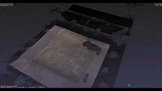

## Resume

### Career Objective

An engineer interested in making concise, accessible, and intuitive data visualizations for better reasoning about complex relationships between data.

### Projects

1. [3D computer vision tracking with the Microsoft Kinect](https://github.com/Chaconine/Depth-tracking)

<iframe width="420" height="315" src="https://youtu.be/pSL2Q0v8fgA" frameborder="0" allowfullscreen></iframe>

- Developed 3D visualizer for Python with package pptk that renders 2 million points

- Tested unsupervised methods for understanding social behaviors

2. [Static website design for Taga Lab at Berkeley](https://chaconine.github.io/research.html)
- Written from scratch, hosted on github pages

3. Visualizations in D3.js

4. Training graph neural networks 
- Non-Euclidean relationships between data, (i.e. social graphs, citation networks) require unique approaches to embedding data so they can be visualized 

### Hobbies

1. Math with manim, initially developed by 3b1b

2. Rome-wasnt-built-in-a-day, a visual 3d voxel bridge builder that uses reinforcement learning policies to build bridges of varying complexity, working with Lyric Doshi

3. [Elementary Differential Geometry](https://netmath.illinois.edu/college/math-423), Math 423 at UIUC, inspired parametric curve tracing on unit sphere in D3.js

4. [Blogging about neuroscience](https://sonichedgehogs.com/)

### Education
**UC Berkeley** 
Bachelor of Science in Microbial Biology 
GPA 3.71/4.00 

